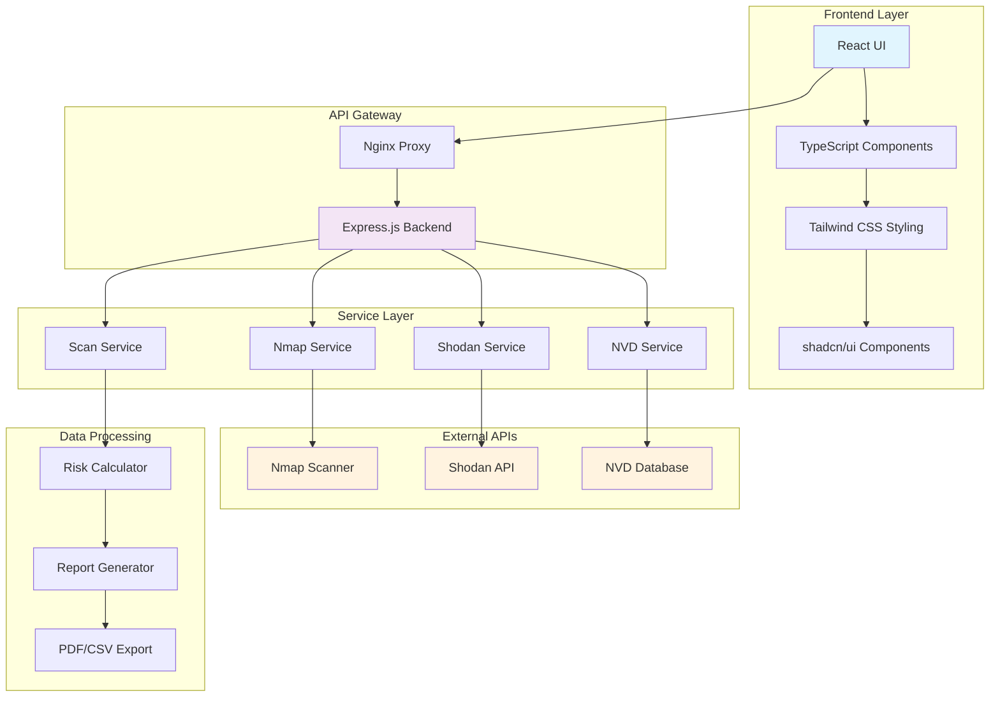
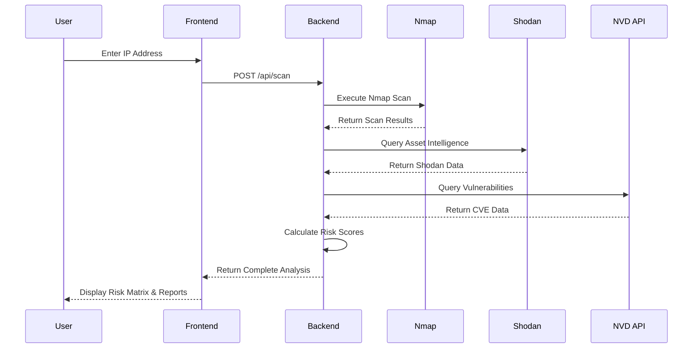

# 🛡️ Quantitative Risk Management System (QRMS)

<div align="center">
  
  
  
  
</div>

<div align="center">
  <h3>🔧 Technology Stack</h3>
  
  <!-- Frontend Technologies -->
  
  
  
  
  
  <!-- Backend Technologies -->
  
  
  
  
  <!-- DevOps & Tools -->
  
  
  
  
  <!-- Security Tools -->
  
  
  
</div>

<div align="center">
  <h3>🛡️ Security Standards & Compliance</h3>
  
  
  
  
  
  
</div>

## 📋 Table of Contents

- [⚠️ Legal Disclaimer](#️-legal-disclaimer)
- [🎯 Overview](#-overview)
- [🏗️ System Architecture](#️-system-architecture)
- [✨ Key Features](#-key-features)
- [🛠️ Technology Stack](#️-technology-stack)
- [📋 Prerequisites](#-prerequisites)
- [🚀 Installation](#-installation)
- [💡 Usage](#-usage)
- [🔧 API Configuration](#-api-configuration)
- [🔧 Development](#-development)
- [🚀 Deployment](#-deployment)
- [🛠️ Troubleshooting](#️-troubleshooting)
- [🤝 Contributing](#-contributing)
- [📜 Standards Compliance](#-standards-compliance)
- [📄 License](#-license)

## ⚠️ Legal Disclaimer

### 🎓 Educational Purpose Only

> **IMPORTANT**: This software is developed exclusively for **educational, research, and academic purposes**. It is intended to help cybersecurity professionals, students, and researchers understand risk management methodologies and vulnerability assessment techniques.

### 🚨 Prohibited Uses

**This software SHALL NOT be used for:**
- ❌ Unauthorized network scanning or penetration testing
- ❌ Illegal access to systems or networks
- ❌ Malicious activities or cyber attacks
- ❌ Violation of local, national, or international laws
- ❌ Breach of terms of service of any platform or service
- ❌ Any activity that could cause harm to individuals or organizations

### 📜 Legal Compliance

**Users are responsible for:**
- ✅ Obtaining proper authorization before scanning any network or system
- ✅ Complying with all applicable laws and regulations
- ✅ Respecting privacy and confidentiality of data
- ✅ Following ethical hacking and responsible disclosure practices
- ✅ Ensuring compliance with organizational policies

### 🛡️ Liability Disclaimer

**The developers and contributors of this project:**
- 🔒 Are not responsible for any misuse of this software
- 🔒 Do not endorse or encourage any illegal activities
- 🔒 Provide this software "as is" without warranties
- 🔒 Are not liable for any damages resulting from its use
- 🔒 Reserve the right to modify or discontinue the software

### 🎯 Intended Audience

This software is designed for:
- 👨‍🎓 **Cybersecurity Students**: Learning risk assessment methodologies
- 👨‍💻 **Security Professionals**: Understanding quantitative risk analysis
- 🏢 **Academic Institutions**: Teaching cybersecurity concepts
- 🔬 **Researchers**: Studying vulnerability management techniques
- 🏛️ **Authorized Penetration Testers**: With proper scope and authorization

### 📞 Contact for Concerns

If you have concerns about the use of this software or wish to report misuse, please contact:
- 📧 **Email**: security@qrms-project.com
- 🔗 **GitHub Issues**: Report through the official repository

**By using this software, you acknowledge that you have read, understood, and agree to abide by these terms.**

---

## 🎯 Overview

**QRMS** (Quantitative Risk Management System) is an enterprise-grade, automated cyber risk assessment platform that provides comprehensive vulnerability analysis, asset discovery, and risk quantification. Built with modern web technologies and industry-standard security frameworks, QRMS delivers actionable insights for cybersecurity professionals and risk managers.

### 🏆 Key Differentiators

- **Real-time Risk Quantification**: Mathematical risk calculations based on CVSS scores and CIA triad
- **Multi-source Intelligence**: Integration with Shodan, NVD, and Nmap for comprehensive asset profiling
- **Standards Compliance**: Adherence to ISO/IEC 27005, NIST 800-30, and CIS Controls v8
- **Professional Reporting**: Automated PDF/CSV generation with executive summaries
- **Scalable Architecture**: Containerized microservices for enterprise deployment

## 🏗️ System Architecture



### 🔄 Data Flow Diagram



## ✨ Key Features

### 🔍 **Automated Asset Discovery**
- **Nmap Integration**: Advanced port scanning with service detection
- **Service Fingerprinting**: Version detection and OS identification
- **Network Topology**: Comprehensive network asset mapping
- **Real-time Scanning**: Live asset discovery and monitoring

### 🎯 **Asset Classification & Risk Assessment**
- **CIA Triad Analysis**: Confidentiality, Integrity, Availability scoring (1-5 scale)
- **Business Impact Assessment**: Critical asset identification
- **Risk Quantification**: Mathematical risk calculation: `RISK = PROBABILITY × IMPACT`
- **Dynamic Risk Scoring**: Real-time risk score updates

### 🌐 **Threat Intelligence Integration**
- **Shodan API**: Public exposure analysis and geolocation data
- **NVD Integration**: Real-time CVE database queries
- **CVSS Scoring**: Industry-standard vulnerability severity assessment
- **Threat Correlation**: Multi-source intelligence fusion

### 📊 **Advanced Risk Visualization**
- **5x5 Risk Heat Matrix**: Interactive probability vs. impact visualization
- **Color-coded Risk Levels**: CRITICAL, HIGH, MEDIUM, LOW, VERY LOW
- **Asset Positioning**: Graphical risk positioning on matrix
- **Trend Analysis**: Historical risk evolution tracking

### 🛡️ **Risk Treatment & Mitigation**
- **Treatment Strategies**: ACCEPT, MITIGATE, TRANSFER, AVOID recommendations
- **Residual Risk Calculation**: Post-mitigation risk assessment
- **Compliance Mapping**: Control framework alignment
- **Action Plan Generation**: Automated remediation roadmaps

### 📈 **Professional Reporting**
- **Executive Dashboards**: KPI visualization and metrics
- **Technical Reports**: Detailed vulnerability analysis
- **Export Capabilities**: PDF and CSV report generation
- **Scheduled Reporting**: Automated report delivery

### 🔔 **Continuous Monitoring**
- **Scheduled Scans**: Automated 7-day scan cycles
- **Change Detection**: Asset and vulnerability monitoring
- **Alert System**: Email notifications for new threats
- **Compliance Tracking**: Ongoing standards adherence

## 🛠️ Technology Stack

### 🎨 Frontend Technologies
<div align="left">
  
  
  
  
  
</div>

- **Framework**: React 18+ with TypeScript for type safety
- **Build Tool**: Vite for lightning-fast development and builds
- **Styling**: Tailwind CSS for utility-first responsive design
- **UI Components**: shadcn/ui for consistent, accessible design system
- **State Management**: React Query for efficient API state management
- **Icons**: Lucide React for modern, consistent iconography

### ⚡ Backend Technologies
<div align="left">
  
  
  
  
  
</div>

- **Runtime**: Node.js 18+ with Express.js framework
- **Language**: JavaScript ES6+ modules with async/await
- **Security**: CORS middleware for secure cross-origin requests
- **External APIs**: Integrated Shodan, NVD, and Nmap services
- **Document Generation**: PDFKit for professional report creation
- **Data Processing**: xml2js for Nmap XML output parsing

### 🔧 DevOps & Infrastructure
<div align="left">
  
  
  
  
  
</div>

- **Containerization**: Docker & Docker Compose for consistent deployment
- **Reverse Proxy**: Nginx for load balancing and SSL termination
- **Orchestration**: Docker Swarm and Kubernetes ready
- **Version Control**: Git with GitHub for collaborative development
- **CI/CD**: GitHub Actions compatible for automated deployments

### 🛡️ Security & Scanning Tools
<div align="left">
  
  
  
  
  
</div>

- **Network Scanning**: Nmap for comprehensive port and service discovery
- **Threat Intelligence**: Shodan API for public exposure analysis
- **Vulnerability Database**: NVD API for real-time CVE information
- **Risk Scoring**: CVSS integration for standardized vulnerability assessment
- **Security Standards**: Compliance with multiple security frameworks

## 📋 Prerequisites

### System Requirements
- **Operating System**: Windows 10/11, macOS 10.15+, Ubuntu 18.04+
- **Memory**: Minimum 4GB RAM, Recommended 8GB+
- **Storage**: 2GB available disk space
- **Network**: Internet connection for external API access

### Software Dependencies
- **Docker**: Version 20.10+
- **Docker Compose**: Version 2.0+
- **Node.js**: Version 18+ (for development)
- **Git**: Version 2.30+

### Network Requirements
- **Outbound Access**: HTTPS (443) for API calls
- **Nmap**: Must be installed on host system
- **Firewall**: Ports 80, 4000 for local services

## 🚀 Installation

### Method 1: Docker Compose (Recommended)

1. **Clone the Repository**
   ```bash
   git clone https://github.com/your-username/QuantitiveRiskManagment.git
   cd QuantitiveRiskManagment
   ```

2. **Environment Setup**
   ```bash
   # Create environment file
   cp .env.example .env
   
   # Configure API keys (see API Configuration section)
   nano .env
   ```

3. **Build and Deploy**
   ```bash
   # Build and start all services
   docker-compose up -d
   
   # Verify deployment
   docker-compose ps
   ```

4. **Access the Application**
   - **Frontend**: http://localhost
   - **Backend API**: http://localhost:4000
   - **Health Check**: http://localhost:4000/health

### Method 2: Manual Docker Build

1. **Build Backend**
   ```bash
   cd backend
   docker build -t qrms-backend .
   docker run -d -p 4000:4000 --name qrms-backend qrms-backend
   ```

2. **Build Frontend**
   ```bash
   cd frontend
   docker build -t qrms-frontend .
   docker run -d -p 80:80 --name qrms-frontend qrms-frontend
   ```

### Method 3: Development Setup

1. **Backend Setup**
   ```bash
   cd backend
   npm install
   npm run dev
   ```

2. **Frontend Setup**
   ```bash
   cd frontend
   npm install
   npm run dev
   ```

## 💡 Usage

### Quick Start Guide

1. **Access the Dashboard**
   - Navigate to http://localhost
   - The modern, dark-themed interface will load

2. **Initiate a Scan**
   - Enter target IP address in the scan input
   - Click "Start Scan" to begin analysis
   - Monitor real-time scan progress

3. **Analyze Results**
   - **Asset Inventory**: Review discovered services and versions
   - **Vulnerability List**: Examine CVEs and CVSS scores
   - **Risk Matrix**: Visualize risk positioning on 5x5 heatmap
   - **Threat Intelligence**: Review Shodan exposure data

4. **Generate Reports**
   - Click "Export PDF" for executive summary
   - Use "Export CSV" for detailed data analysis
   - Schedule automated report delivery

### Advanced Features

#### Custom Risk Scoring
```javascript
// Risk calculation formula
const riskScore = (probability, impact) => {
  return (probability * impact);
};

// CIA Impact calculation
const ciaImpact = (confidentiality, integrity, availability) => {
  return Math.ceil((confidentiality + integrity + availability) / 3);
};
```

#### API Integration Examples
```bash
# Manual API calls
curl -X POST http://localhost:4000/api/scan \
  -H "Content-Type: application/json" \
  -d '{"ip": "192.168.1.1"}'

# Health check
curl http://localhost:4000/health
```

## 🔧 API Configuration

### Required API Keys

1. **Shodan API Key**
   - Register at: https://shodan.io/
   - Free tier: 100 queries/month
   - Paid plans: Unlimited queries

2. **NVD API Key**
   - Register at: https://nvd.nist.gov/developers
   - Free tier: 50 requests/30 seconds
   - Enhanced: 5000 requests/30 seconds

### Configuration Setup

Create `.env` file in project root:
```env
# API Configuration
SHODAN_API_KEY=your_shodan_api_key_here
NVD_API_KEY=your_nvd_api_key_here

# Application Configuration
NODE_ENV=production
PORT=4000
FRONTEND_URL=http://localhost

# Security
CORS_ORIGIN=http://localhost
API_RATE_LIMIT=100

# Email Configuration (Optional)
SMTP_HOST=smtp.gmail.com
SMTP_PORT=587
SMTP_USER=your_email@gmail.com
SMTP_PASS=your_app_password
```

## 🔧 Development

### Project Structure
```
QuantitiveRiskManagment/
├── backend/
│   ├── index.js              # Express server
│   ├── services/             # Business logic
│   │   ├── nmapService.js    # Nmap integration
│   │   ├── shodanService.js  # Shodan API
│   │   ├── nvdService.js     # NVD API
│   │   └── scanService.js    # Scan orchestration
│   ├── Dockerfile
│   └── package.json
├── frontend/
│   ├── src/
│   │   ├── components/       # React components
│   │   ├── pages/           # Route components
│   │   ├── services/        # API clients
│   │   └── hooks/           # Custom hooks
│   ├── Dockerfile
│   └── package.json
├── docker-compose.yml
└── README.md
```

### Development Commands

```bash
# Backend development
cd backend
npm run dev          # Start with nodemon
npm run start        # Production start
npm run test         # Run tests

# Frontend development
cd frontend
npm run dev          # Vite dev server
npm run build        # Production build
npm run preview      # Preview build
npm run lint         # ESLint check

# Docker commands
docker-compose up -d              # Start services
docker-compose down               # Stop services
docker-compose logs -f            # View logs
docker-compose exec backend bash # Backend shell
```

### Code Quality

```bash
# Frontend linting
npm run lint

# Type checking
npm run type-check

# Format code
npm run format

# Pre-commit hooks
npx husky install
```

## 🚀 Deployment

### Production Deployment

1. **Environment Preparation**
   ```bash
   # Set production environment
   export NODE_ENV=production
   
   # Configure environment variables
   cp .env.example .env.production
   ```

2. **Docker Swarm Deployment**
   ```bash
   # Initialize swarm
   docker swarm init
   
   # Deploy stack
   docker stack deploy -c docker-compose.yml qrms-stack
   ```

3. **Kubernetes Deployment**
   ```bash
   # Apply configurations
   kubectl apply -f k8s/
   
   # Verify deployment
   kubectl get pods -n qrms
   ```

### Monitoring & Maintenance

```bash
# Check service health
curl http://localhost:4000/health

# Monitor logs
docker-compose logs -f --tail=100

# System metrics
docker stats

# Database backup (if applicable)
docker exec qrms-db mysqldump -u root -p qrms > backup.sql
```

## 🛠️ Troubleshooting

### Common Issues

#### Issue: Container Build Fails
```bash
# Solution: Clean Docker cache
docker system prune -a
docker-compose build --no-cache
```

#### Issue: API Keys Not Working
```bash
# Solution: Verify environment variables
docker-compose exec backend printenv | grep API
```

#### Issue: Nmap Not Found
```bash
# Solution: Install Nmap in container
docker-compose exec backend apt-get update && apt-get install -y nmap
```

#### Issue: CORS Errors
```bash
# Solution: Check CORS configuration
grep -r "cors" backend/
```

### Debug Mode

```bash
# Enable debug logging
export DEBUG=qrms:*
docker-compose up

# View detailed logs
docker-compose logs -f backend | grep DEBUG
```

### Performance Optimization

```bash
# Monitor resource usage
docker stats qrms-backend qrms-frontend

# Optimize Docker images
docker-compose build --compress

# Enable gzip compression
# (Already configured in Nginx)
```

## 🤝 Contributing

### Development Workflow

1. **Fork the Repository**
   ```bash
   git clone https://github.com/your-username/QuantitiveRiskManagment.git
   cd QuantitiveRiskManagment
   ```

2. **Create Feature Branch**
   ```bash
   git checkout -b feature/your-feature-name
   ```

3. **Development Setup**
   ```bash
   docker-compose up -d
   npm install
   ```

4. **Make Changes**
   - Follow TypeScript best practices
   - Add proper error handling
   - Write comprehensive tests
   - Update documentation

5. **Submit Pull Request**
   ```bash
   git add .
   git commit -m "feat: add new feature"
   git push origin feature/your-feature-name
   ```

### Code Standards

- **TypeScript**: Strict mode enabled
- **ESLint**: Airbnb configuration
- **Prettier**: Code formatting
- **Husky**: Pre-commit hooks
- **Jest**: Unit testing framework

## 📜 Standards Compliance

### Security Frameworks
- **ISO/IEC 27005:2022**: Information Security Risk Management
- **NIST SP 800-30 Rev.1**: Risk Assessment Guide
- **CIS Controls v8**: Critical Security Controls
- **OWASP Top 10**: Web Application Security

### Regional Compliance
- **SPDP Ecuador 2025**: Data Protection Standards
- **GDPR**: General Data Protection Regulation
- **SOX**: Sarbanes-Oxley Act Compliance

### Quality Assurance
- **≥90%** Asset categorization accuracy
- **<2s** Response time per keyword
- **100%** Scan history retention
- **≥3** Keywords analyzed per scan

## 📄 License

### 📜 MIT License with Educational Restrictions

This project is licensed under the **MIT License** with additional educational use restrictions.

<div align="center">
  
  
  
</div>

### 🔐 License Terms

```
MIT License - Educational Use Only

Copyright (c) 2025 QRMS Development Team

Permission is hereby granted, free of charge, to any person obtaining a copy
of this software and associated documentation files (the "Software"), to deal
in the Software without restriction for EDUCATIONAL PURPOSES ONLY, including 
without limitation the rights to use, copy, modify, merge, publish, distribute, 
sublicense, and/or sell copies of the Software for educational use, and to 
permit persons to whom the Software is furnished to do so, subject to the 
following conditions:

EDUCATIONAL USE RESTRICTION:
This Software is intended exclusively for educational, academic, research, and 
training purposes. Any use for illegal activities, unauthorized network scanning, 
or malicious purposes is strictly prohibited and may result in legal action.

The above copyright notice and this permission notice shall be included in all
copies or substantial portions of the Software.

THE SOFTWARE IS PROVIDED "AS IS", WITHOUT WARRANTY OF ANY KIND, EXPRESS OR
IMPLIED, INCLUDING BUT NOT LIMITED TO THE WARRANTIES OF MERCHANTABILITY,
FITNESS FOR A PARTICULAR PURPOSE AND NONINFRINGEMENT. IN NO EVENT SHALL THE
AUTHORS OR COPYRIGHT HOLDERS BE LIABLE FOR ANY CLAIM, DAMAGES OR OTHER
LIABILITY, WHETHER IN AN ACTION OF CONTRACT, TORT OR OTHERWISE, ARISING FROM,
OUT OF OR IN CONNECTION WITH THE SOFTWARE OR THE USE OR OTHER DEALINGS IN THE
SOFTWARE.
```

### ⚖️ Additional Legal Disclaimers

#### 🎓 Educational Institution Use
- **Universities and Colleges**: May use for cybersecurity curriculum
- **Training Centers**: May use for professional development courses
- **Certification Programs**: May use for security certification training
- **Research Institutions**: May use for academic research purposes

#### 🚫 Prohibited Activities
- **Unauthorized Scanning**: No scanning without explicit permission
- **Illegal Access**: No attempts to access systems without authorization
- **Commercial Exploitation**: No commercial use without separate license
- **Malicious Activities**: No use for harmful or destructive purposes

#### 📞 Legal Contact Information
For legal inquiries, licensing questions, or to report misuse:
- **Email**: legal@qrms-project.com
- **Address**: [Your Legal Address]
- **Phone**: [Your Contact Number]

#### 🛡️ Indemnification
Users agree to indemnify and hold harmless the developers from any claims, damages, or legal issues arising from misuse of this software.

#### 🌍 Jurisdiction
This license is governed by the laws of [Your Jurisdiction] and any disputes shall be resolved in the courts of [Your Jurisdiction].

---

### 🎯 Acceptable Use Policy

#### ✅ Permitted Uses
- Academic research and education
- Security training and certification
- Authorized penetration testing (with proper documentation)
- Personal learning and skill development
- Open source contributions and improvements

#### ❌ Prohibited Uses
- Unauthorized network reconnaissance
- Illegal system access attempts
- Commercial security services (without license)
- Malicious vulnerability exploitation
- Violation of computer fraud and abuse laws

### 📋 Compliance Statement

By using this software, you acknowledge that:
1. You have read and understood all terms and conditions
2. You agree to use the software only for educational purposes
3. You will not use the software for any illegal activities
4. You understand the legal implications of misuse
5. You will comply with all applicable laws and regulations

---

---

<div align="center">
  <h2>🛡️ Built with ❤️ for Cybersecurity Education</h2>
  
  <div>
    
    
    
  </div>
  
  <br>
  
  <div>
    <strong>🎓 Educational Use Only | 🔒 Responsible Disclosure | 📚 Academic Research</strong>
  </div>
  
  <br>
  
  <div>
    <strong>📧 Support:</strong> <a href="mailto:support@qrms-project.com">support@qrms-project.com</a><br>
    <strong>⚖️ Legal:</strong> <a href="mailto:legal@qrms-project.com">legal@qrms-project.com</a><br>
    <strong>🔒 Security:</strong> <a href="mailto:security@qrms-project.com">security@qrms-project.com</a>
  </div>
  
  <br>
  
  <div>
    
    
    
  </div>
  
  <br>
  
  <p><em>⚠️ This software is provided for educational purposes only. Users are responsible for compliance with all applicable laws and regulations. Unauthorized use is strictly prohibited.</em></p>
</div>
